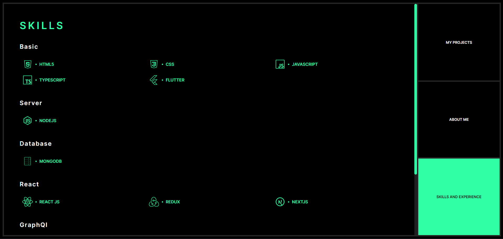

# Portfolio Website 

This portfolio website, built with React.js, Next.js, and Tailwind CSS, offers a straightforward design with three main pages. The About page provides insights into my background, while the Projects section showcases my past work. Lastly, the Skills page details the areas in which I excel.
## Features 

- **Responsive Design**: The website is designed to be responsive and looks good on various devices and screen sizes. 
- **Next.js**: Utilizes the power of Next.js. 
- **React.js**: Built with React.js, a popular JavaScript library for building user interfaces. 
- **Tailwind CSS**: Styled with Tailwind CSS, a utility-first CSS framework for quickly building custom designs.

## Preview

